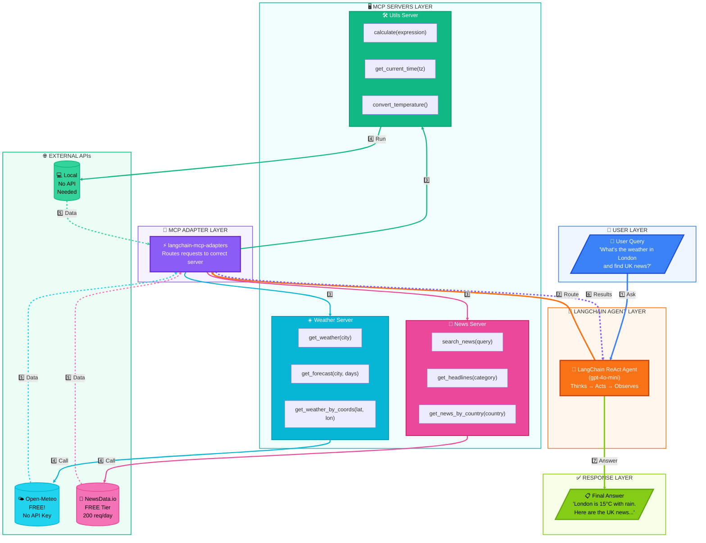

# LangChain + MCP Tutorial (FREE APIs!)

A complete, production-ready example demonstrating how to build LangChain agents that connect to multiple MCP (Model Context Protocol) servers using **completely FREE APIs**.

## What You'll Learn

- What MCP is and why it's useful
- How to create MCP servers with FastMCP
- How to connect LangChain agents to multiple MCP servers
- Best practices for modular AI tool systems

## APIs Used (All FREE!)

| Service | Purpose | API Key Needed? | Free Tier |
|---------|---------|-----------------|-----------|
| **Open-Meteo** | Weather data | **No!** | 10,000 req/day |
| **NewsData.io** | News articles | Yes (free signup) | 200 req/day |
| **OpenAI** | LLM (gpt-4o-mini) | Yes | $5 free credits |

## Project Structure

```
langChain_MCP/
├── weather_server.py      # MCP Server: Weather (Open-Meteo - FREE!)
├── news_server.py         # MCP Server: News (NewsData.io - FREE tier)
├── utils_server.py        # MCP Server: Calculator, Time (NO API!)
├── agent_main.py          # LangChain agent using all servers
├── without_mcp_example.py # Comparison: Same thing WITHOUT MCP
├── requirements.txt       # Python dependencies
├── .env.example          # API key template
├── .gitignore            # Prevents committing secrets
└── README.md             # This file
```

## Quick Start (5 Minutes!)

### 1. Navigate to the project

```bash
cd langChain_MCP
```

### 2. Create virtual environment (recommended)

```bash
python -m venv venv
source venv/bin/activate    # macOS/Linux
# OR: venv\Scripts\activate  # Windows
```

### 3. Install dependencies

```bash
pip install -r requirements.txt
```

### 4. Get your API keys

#### OpenAI (Required)
1. Go to [OpenAI Platform](https://platform.openai.com/api-keys)
2. Sign up or sign in
3. Create a new API key
4. Copy the key

#### NewsData.io (Optional but recommended)
1. Go to [NewsData.io](https://newsdata.io/register)
2. Sign up with your email
3. Verify your email
4. Copy your API key from the dashboard

#### Open-Meteo (Weather)
**No API key needed!** It just works!

### 5. Set up environment variables

```bash
cp .env.example .env
```

Edit `.env` with your keys:

```env
OPENAI_API_KEY=sk-your-openai-key-here
NEWSDATA_API_KEY=your-newsdata-key-here  # Optional
```

### 6. Run the agent!

```bash
python agent_main.py
```

## Example Queries

Try these to see the agent use multiple tools:

```
"What's the weather in London and find any news about UK weather?"
```
→ Uses: `get_weather` + `search_news`

```
"Get the 5-day forecast for Tokyo and search for technology news"
```
→ Uses: `get_forecast` + `search_news`

```
"What time is it in New York and what's the weather there?"
```
→ Uses: `get_current_time` + `get_weather`

```
"Calculate 15% of 299.99"
```
→ Uses: `calculate`

## Understanding MCP

### What is MCP?

**Model Context Protocol (MCP)** is a standard way to connect AI models to external tools. Think of it as a "USB for AI" - a universal interface that works with any MCP-compatible system.

### Architecture

```
    ┌─────────────────────────────────────────────────────────────┐
    │                     Your Question                           │
    │     "What's the weather in London and find UK news?"        │
    └─────────────────────┬───────────────────────────────────────┘
                          │
                          ▼
    ┌─────────────────────────────────────────────────────────────┐
    │                 LangChain ReAct Agent                       │
    │                   (gpt-4o-mini)                             │
    │                                                             │
    │  Thinks: "I need weather AND news tools"                    │
    │  Acts: Calls appropriate MCP servers                        │
    └─────────────────────┬───────────────────────────────────────┘
                          │
    ┌─────────────────────▼───────────────────────────────────────┐
    │               langchain-mcp-adapters                        │
    │            (Routes to correct server)                       │
    └───────┬─────────────────┬─────────────────┬─────────────────┘
            │                 │                 │
            ▼                 ▼                 ▼
    ┌───────────────┐ ┌───────────────┐ ┌───────────────┐
    │    Weather    │ │     News      │ │    Utils      │
    │  MCP Server   │ │  MCP Server   │ │  MCP Server   │
    │               │ │               │ │               │
    │ • get_weather │ │ • search_news │ │ • calculate   │
    │ • get_forecast│ │ • headlines   │ │ • time        │
    └───────┬───────┘ └───────┬───────┘ └───────────────┘
            │                 │                 │
            ▼                 ▼                 │
    ┌───────────────┐ ┌───────────────┐        │
    │  Open-Meteo   │ │ NewsData.io   │   (Local)
    │    (FREE!)    │ │  (FREE tier)  │
    └───────────────┘ └───────────────┘
```

### Why Use MCP? - Key Benefits

| Aspect | Without MCP | With MCP |
|--------|-------------|----------|
| **Code Organization** | Everything in one file | Separate, focused servers |
| **Maintainability** | Change one thing, risk breaking others | Change one server independently |
| **Reusability** | Copy-paste code to reuse | Any MCP client can use your server |
| **Adding Tools** | Refactor existing code | Add 1 config line |
| **Testing** | Test entire system | Test each server in isolation |
| **Team Work** | Merge conflicts | Teams work on separate servers |

### Comparison: See It Yourself!

Run the non-MCP version to compare:

```bash
python without_mcp_example.py
```

Notice how much more code is needed when everything is in one file!

## Available Tools

### Weather Server (Open-Meteo - FREE!)

| Tool | Description |
|------|-------------|
| `get_weather(city)` | Current weather for a city |
| `get_forecast(city, days)` | Multi-day weather forecast |
| `get_weather_by_coordinates(lat, lon)` | Weather for exact coordinates |

### News Server (NewsData.io - 200 free/day)

| Tool | Description |
|------|-------------|
| `search_news(query)` | Search for news articles |
| `get_headlines(category, country)` | Top headlines by category |
| `get_news_by_country(country, topic)` | Country-specific news |

### Utils Server (No API needed!)

| Tool | Description |
|------|-------------|
| `calculate(expression)` | Safe math evaluation |
| `get_current_time(timezone)` | Current time anywhere |
| `convert_timezone(time, from, to)` | Timezone conversion |
| `convert_temperature(val, from, to)` | Temperature conversion |

## Adding Your Own MCP Server

One of MCP's key benefits is how easy it is to add new servers!

### Step 1: Create your server file

```python
# my_server.py
from mcp.server.fastmcp import FastMCP

mcp = FastMCP("my-server")

@mcp.tool()
async def my_tool(param: str) -> str:
    """Description of what this tool does."""
    return f"Result for {param}"

if __name__ == "__main__":
    mcp.run()
```

### Step 2: Add ONE line to the agent config

In `agent_main.py`:

```python
MCP_SERVERS = {
    "weather": {...},
    "news": {...},
    "utils": {...},
    # Just add this:
    "myserver": {
        "command": "python",
        "args": ["my_server.py"],
        "transport": "stdio",
    },
}
```

That's it! The agent automatically discovers and uses your new tools.

## Troubleshooting

### "OPENAI_API_KEY not set"

- Make sure you created `.env` from `.env.example`
- Check that you added your actual API key
- Don't use quotes around the key value

### "NEWSDATA_API_KEY not set"

- This is optional - weather and utils tools still work
- Get your free key at: https://newsdata.io/register

### Weather tools not working

- Open-Meteo doesn't need an API key
- Check your internet connection
- Try a well-known city like "London" or "Tokyo"

### Import errors

- Make sure you activated your virtual environment
- Run `pip install -r requirements.txt` again

### MCP server won't start

- Check Python is in your PATH
- Verify all files exist in the same directory
- Check for syntax errors with `python weather_server.py`

## API Documentation Links

- **Open-Meteo**: https://open-meteo.com/en/docs
- **NewsData.io**: https://newsdata.io/documentation
- **MCP Specification**: https://spec.modelcontextprotocol.io/
- **LangChain MCP**: https://python.langchain.com/docs/integrations/tools/mcp

## License

MIT License - Use freely for learning and building!

---

## Architecture Diagram



### Diagram Legend

| Layer | Color | Description |
|-------|-------|-------------|
| 🔵 **User Layer** | Blue | Your natural language question to the agent |
| 🟠 **Agent Layer** | Orange | LangChain ReAct Agent powered by gpt-4o-mini |
| 🟣 **Adapter Layer** | Purple | langchain-mcp-adapters routes to correct servers |
| 🔷 **Weather Server** | Cyan | MCP server for weather tools (Open-Meteo) |
| 🩷 **News Server** | Pink | MCP server for news tools (NewsData.io) |
| 🟢 **Utils Server** | Green | MCP server for utilities (local, no API) |
| 🟩 **Response** | Lime | Final combined answer from the agent |

### Data Flow

1. **User** sends a natural language query
2. **LangChain Agent** reasons about which tools are needed
3. **MCP Adapter** routes requests to appropriate MCP servers
4. **MCP Servers** call their respective APIs or perform local operations
5. **Results** flow back through the adapter to the agent
6. **Agent** combines all results into a coherent final answer

---

**Happy coding!** 🚀

If this helped you understand MCP, consider starring the repo!
