# LangChain Agent WITHOUT MCP - Complete Guide

## Overview

This document explains `without_mcp_example.py` - a LangChain agent built using the **traditional approach** (without MCP). This file exists for **educational comparison** to help you understand why MCP is beneficial.

---

## What This File Demonstrates

The `without_mcp_example.py` file shows how to build a multi-tool AI agent the "old way":

> [!WARNING]
> - 🔴 **All tools defined in ONE file** (~350 lines)
> - 🔴 **All API logic mixed together**
> - 🔴 **Manual tool registration**
> - 🔴 **Tightly coupled architecture**

---

## File Structure Breakdown

### 1. Imports & Configuration (Lines 47-64)

```python
import os, math, httpx
from langchain_openai import ChatOpenAI
from langchain_core.tools import tool
from langgraph.prebuilt import create_react_agent
```

> [!WARNING]
> **What's happening:**
> - 🔴 Import ALL dependencies needed for EVERY tool
> - 🔴 Load environment variables for API keys
> - 🔴 Everything in one place = harder to manage

---

### 2. Weather Tools (Lines 66-190)

Two tools that would normally be in `weather_server.py` with MCP:

#### `get_weather(city)`
```python
@tool
async def get_weather(city: str) -> str:
    # 1. Geocode city name → coordinates
    geo = await _geocode_city(city)

    # 2. Call Open-Meteo API
    response = await client.get(
        "https://api.open-meteo.com/v1/forecast",
        params={"latitude": lat, "longitude": lon, ...}
    )

    # 3. Format and return result
    return f"Weather for {name}: {temp}°C, {conditions}"
```

#### `get_forecast(city, days)`
```python
@tool
async def get_forecast(city: str, days: int = 5) -> str:
    # Similar pattern: geocode → API call → format response
```

> [!CAUTION]
> **🔴 THE PROBLEM:** All this weather logic is mixed in with news and utility tools!

---

### 3. News Tools (Lines 192-273)

Two tools that would normally be in `news_server.py` with MCP:

#### `search_news(query)`
```python
@tool
async def search_news(query: str) -> str:
    # Call NewsData.io API
    response = await client.get(
        "https://newsdata.io/api/1/news",
        params={"apikey": NEWSDATA_API_KEY, "q": query}
    )
    # Format articles and return
```

#### `get_headlines(category, country)`
```python
@tool
async def get_headlines(category: str, country: str) -> str:
    # Similar pattern for fetching headlines
```

> [!CAUTION]
> **🔴 THE PROBLEM:** News API key and logic mixed with weather and utils!

---

### 4. Utility Tools (Lines 276-325)

Two tools that would normally be in `utils_server.py` with MCP:

#### `calculate(expression)`
```python
@tool
async def calculate(expression: str) -> str:
    safe_dict = {"sqrt": math.sqrt, "sin": math.sin, "pi": math.pi, ...}
    result = eval(expression, {"__builtins__": {}}, safe_dict)
    return f"Result: {expression} = {result}"
```

#### `get_current_time(timezone)`
```python
@tool
async def get_current_time(timezone: str) -> str:
    tz = ZoneInfo(tz_name)
    now = datetime.now(tz)
    return f"Time in {tz_name}: {now.strftime('%Y-%m-%d %H:%M:%S')}"
```

---

### 5. Manual Tool Registration (Lines 328-340)

```python
ALL_TOOLS = [
    get_weather,
    get_forecast,
    search_news,
    get_headlines,
    calculate,
    get_current_time,
]
```

> [!CAUTION]
> **🔴 THE PROBLEM:** Every time you add a tool, you must:
> 1. Write the tool function
> 2. Manually add it to this list
> 3. Hope you didn't break anything else
>
>
> ✅ **With MCP, tools are auto-discovered from connected servers!**

---

### 6. Agent Creation & Main Loop (Lines 343-415)

```python
async def main():
    # Initialize LLM
    llm = ChatOpenAI(model="gpt-4o-mini", temperature=0)

    # Create agent with ALL tools
    agent = create_react_agent(llm, ALL_TOOLS)

    # Interactive loop
    while True:
        user_input = input("🧑 You: ")
        result = await agent.ainvoke({"messages": [("user", user_input)]})
        print(f"🤖 Agent: {result['messages'][-1].content}")
```

---

## How the Agent Works (Step by Step)

### Example Query: "What's the weather in Paris?"

| Step | What Happens |
|------|--------------|
| 1 | User types query |
| 2 | Query sent to `create_react_agent` |
| 3 | LLM (gpt-4o-mini) receives query + list of 6 tools |
| 4 | LLM **reasons**: "I need weather data → use `get_weather`" |
| 5 | LLM generates tool call: `get_weather("Paris")` |
| 6 | Tool executes: Geocodes "Paris" → calls Open-Meteo API |
| 7 | Tool returns: "Weather for Paris: 18°C, Partly cloudy" |
| 8 | LLM formulates response to user |
| 9 | User sees: "The weather in Paris is 18°C and partly cloudy." |

---

## The Problems with This Approach

> [!CAUTION]
> ### 🔴 Problem 1: Monolithic File
> - **350+ lines** in one file
> - Hard to navigate
> - Hard to maintain
> - High cognitive load

> [!CAUTION]
> ### 🔴 Problem 2: Tight Coupling
> - Weather, news, and utils code all intertwined
> - Change one thing, risk breaking another
> - Can't update tools independently

> [!CAUTION]
> ### 🔴 Problem 3: No Reusability
> - Want to use `get_weather` in another project?
> - Must copy-paste the entire function + helper functions
> - API keys and configs come along too

> [!CAUTION]
> ### 🔴 Problem 4: Manual Registration
> - Must remember to add each tool to `ALL_TOOLS`
> - Easy to forget
> - No auto-discovery

> [!CAUTION]
> ### 🔴 Problem 5: All API Keys in One Place
> - `OPENAI_API_KEY` + `NEWSDATA_API_KEY` in same file
> - Security risk if file is shared
> - Hard to manage per-tool credentials

---

## Comparison: Without MCP vs With MCP

| Aspect | 🔴 Without MCP | ✅ With MCP |
|--------|-------------|----------|
| **Lines of code** | ❌ ~350 for 6 tools | ✅ ~150 agent + separate servers |
| **File structure** | ❌ 1 giant file | ✅ Modular server files |
| **Adding tools** | ❌ Modify main file | ✅ Add new server file |
| **Tool discovery** | ❌ Manual list | ✅ Automatic |
| **Reusability** | ❌ Copy-paste | ✅ Import server |
| **API key management** | ❌ All in one place | ✅ Isolated per server |
| **Maintenance** | ❌ Difficult | ✅ Easy |
| **Testing** | ❌ Test entire file | ✅ Test servers independently |

---

## When to Use This Approach

The traditional approach (without MCP) is acceptable when:

- ✅ You have only 1-2 simple tools
- ✅ It's a quick prototype or demo
- ✅ You'll never reuse the tools
- ✅ You're learning LangChain basics

**Use MCP when:**

- ✅ You have 3+ tools
- ✅ Tools come from different domains (weather, news, etc.)
- ✅ You want reusable components
- ✅ Building a production system

---

## Running the Example

```bash
# Navigate to directory
cd langChain_MCP

# Ensure virtual environment is active
source venv/bin/activate

# Set up environment variables
cp .env.example .env
# Edit .env with your OPENAI_API_KEY

# Run
python without_mcp_example.py
```

### Sample Session

```
🧑 You: What's the weather in Tokyo?

🌤️  [Direct Tool] get_weather(Tokyo)

🤖 Agent: The current weather in Tokyo, Japan is 22°C with
partly cloudy skies, humidity at 65%, and wind speed of 12 km/h.
```

---

## Architecture Diagram

```mermaid
flowchart TD
    subgraph USER["👤 USER"]
        A[/"🧑 User Query:<br/>'What's the weather in Paris<br/>and find tech news?'"/]
    end

    subgraph AGENT["🤖 LANGCHAIN AGENT (One Giant File!)"]
        B["🧠 LLM Reasoning<br/>(gpt-4o-mini)"]

        subgraph TOOLS["📦 ALL TOOLS IN ONE FILE (~350 lines)"]
            subgraph WEATHER["🌤️ Weather Tools"]
                C1["get_weather()"]
                C2["get_forecast()"]
            end

            subgraph NEWS["📰 News Tools"]
                D1["search_news()"]
                D2["get_headlines()"]
            end

            subgraph UTILS["🔧 Utility Tools"]
                E1["calculate()"]
                E2["get_current_time()"]
            end
        end
    end

    subgraph APIS["🌐 EXTERNAL APIs"]
        F["Open-Meteo<br/>(Weather)"]
        G["NewsData.io<br/>(News)"]
    end

    subgraph RESPONSE["✅ RESPONSE"]
        H[/"Final Answer to User"/]
    end

    A --> B
    B --> C1
    B --> D1
    C1 --> F
    D1 --> G
    F --> B
    G --> B
    B --> H

    style A fill:#2196F3,stroke:#1565C0,stroke-width:2px,color:#fff
    style B fill:#FF9800,stroke:#E65100,stroke-width:2px,color:#fff
    style C1 fill:#9C27B0,stroke:#6A1B9A,stroke-width:2px,color:#fff
    style C2 fill:#9C27B0,stroke:#6A1B9A,stroke-width:2px,color:#fff
    style D1 fill:#E91E63,stroke:#AD1457,stroke-width:2px,color:#fff
    style D2 fill:#E91E63,stroke:#AD1457,stroke-width:2px,color:#fff
    style E1 fill:#00BCD4,stroke:#00838F,stroke-width:2px,color:#fff
    style E2 fill:#00BCD4,stroke:#00838F,stroke-width:2px,color:#fff
    style F fill:#4CAF50,stroke:#2E7D32,stroke-width:2px,color:#fff
    style G fill:#4CAF50,stroke:#2E7D32,stroke-width:2px,color:#fff
    style H fill:#8BC34A,stroke:#558B2F,stroke-width:3px,color:#000

    style WEATHER fill:#F3E5F5,stroke:#9C27B0,stroke-width:2px
    style NEWS fill:#FCE4EC,stroke:#E91E63,stroke-width:2px
    style UTILS fill:#E0F7FA,stroke:#00BCD4,stroke-width:2px
    style TOOLS fill:#FFF3E0,stroke:#FF9800,stroke-width:3px,stroke-dasharray: 5 5
    style AGENT fill:#FFFDE7,stroke:#FFC107,stroke-width:2px
```



---

## Key Takeaway

> [!IMPORTANT]
> **🔴 The traditional approach works, but doesn't scale.**
>
> As you add more tools, the file grows, complexity increases, and maintenance becomes a nightmare.
>
> ✅ **MCP solves this by separating tools into independent, reusable servers.**

---

## Next Steps

Now that you understand the traditional approach, check out:

1. **`agent_main.py`** - The same functionality using MCP (much cleaner!)
2. **`weather_server.py`** - Weather tools as a standalone MCP server
3. **`news_server.py`** - News tools as a standalone MCP server
4. **`utils_server.py`** - Utility tools as a standalone MCP server

Compare the approaches and see why MCP is the better choice for production systems!
