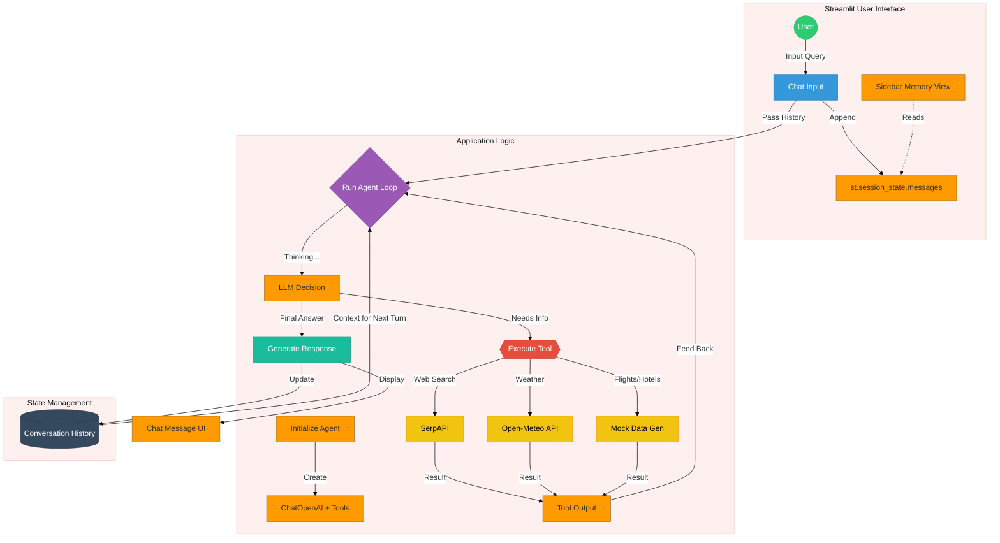

# Streamlit Short-Term Memory Implementation Guide

## Overview
This application is a **Travel Planning Assistant** built with **Streamlit** and **LangChain**. It demonstrates the concept of **Short-Term Memory** (specifically *Conversation Buffer Memory*) in LLM applications. The agent remembers previous context (like locations "Paris" or "Tokyo") to answer follow-up questions effectively.

## Core Concepts

### 1. Conversation Buffer Memory
The core feature of this implementation is how it handles memory. Unlike stateless API calls, this application explicitly manages conversation history.
*   **Mechanism**: It maintains a growing list of `HumanMessage` and `AIMessage` objects in `st.session_state.memory_messages`.
*   **Context Passing**: For every new user input, the **entire** conversation history is passed to the LLM. This allows the model to "remember" what was discussed previously.
*   **Visual Debugging**: The sidebar ("Memory Buffer") displays this raw history, giving users a transparent view of what the AI "knows".

### 2. Tools & Capabilities
The agent is equipped with four specific tools to assist with travel planning:
*   **`web_search`**: Performs Google searches via **SerpAPI** for real-time information (attractions, restaurants).
*   **`get_weather`**: Fetches real-time and forecast weather data using the **Open-Meteo API**.
*   **`search_flights`**: Generates *simulated* flight data (prices, airlines, timings) for demonstration purposes.
*   **`search_hotels`**: Generates *simulated* hotel data (ratings, amenities, prices) for demonstration purposes.

### 3. Agent Architecture
*   **Model**: Uses `gpt-4o-mini` for fast and cost-effective responses.
*   **System Prompt**: Defines the persona ("Travel Planning Assistant") and explicitly instructs the model to use conversation history for context (e.g., resolving "there" to the previously mentioned city).
*   **Execution Loop**: A custom `run_agent` function handles the "ReAct-like" loop:
    1.  LLM decides to call a tool.
    2.  Code executes the tool.
    3.  Tool output is fed back to the LLM.
    4.  Repeat until the LLM generates a final answer.

## Key Files & Structure

*   **`streamlit_short_term_memory.py`**: The main entry point containing all logic.
    *   **Dependency Injection**: Loads API keys from `.env`.
    *   **Tool Definitions**: Decorator-based (`@tool`) definitions for agent capabilities.
    *   **UI Logic**: Streamlit calls for layout, sidebar, and chat interfaces.

## Implementation Flow Diagram

