# Simple ReAct Agent with Tool Calling

## What is ReAct?

**ReAct** stands for **Reason + Act**. It's a pattern where an LLM:
1. **Reasons** about what action to take
2. **Acts** by calling a tool
3. **Observes** the result
4. **Responds** with a final answer

## Example: "What is weather in Paris?"

When you type this query, here's the step-by-step flow:

### Step 1: Query Sent to the Agent

Your input becomes a user message sent to the ReAct agent:
```python
{"messages": [("user", "what is weather in paris")]}
```

### Step 2: LLM Reasoning (the "Re" in ReAct)

The LLM (GPT-4o-mini) receives:
- Your question
- A list of available tools with their descriptions (`get_weather`, `calculate`)

It **reasons** that it needs weather data and identifies `get_weather` as the right tool.

### Step 3: Tool Call (the "Act" in ReAct)

The LLM generates a tool call:
```json
{"tool": "get_weather", "args": {"city": "paris"}}
```

LangGraph executes the `get_weather` function with `city="paris"`.

### Step 4: Tool Response

The function looks up "paris" in the mock dictionary and returns:
```
"15°C and sunny"
```

### Step 5: Final Response

The LLM sees the tool result and formulates a human-readable answer like:
> "The weather in Paris is 15°C and sunny."

## What You See in the Stream Output

Each `chunk` printed shows a step in the process:
- **Agent chunk**: LLM deciding to call a tool
- **Tool chunk**: Result from `get_weather`
- **Agent chunk**: Final response to you

## Flow Diagram

```
User Query
    │
    ▼
┌─────────────────┐
│   LLM Reasons   │  ← "I need to call get_weather"
└────────┬────────┘
         │
         ▼
┌─────────────────┐
│   Tool Called   │  ← get_weather("paris")
└────────┬────────┘
         │
         ▼
┌─────────────────┐
│  Tool Returns   │  ← "15°C and sunny"
└────────┬────────┘
         │
         ▼
┌─────────────────┐
│ LLM Formulates  │  ← "The weather in Paris is 15°C and sunny"
│  Final Answer   │
└────────┬────────┘
         │
         ▼
    User Response
```

## Why ReAct?

The ReAct pattern allows the agent to:
- **Think before acting** - not just guess answers
- **Use external tools** - access real data via APIs
- **Chain multiple steps** - solve complex queries requiring multiple tool calls

## Example: Multi-Tool Query

**Query**: "divide 25 by 5 and add it to paris weather"

This demonstrates the agent using **multiple tools in parallel** to solve a complex query.

### Output

```
[Calling Tool]: calculate
[Input]: {'expression': '25 / 5'}

[Calling Tool]: get_weather
[Input]: {'city': 'Paris'}
[Tool Output]: The result is: 5.0
[Tool Output]: 15°C and sunny

[Final Answer]: The result of dividing 25 by 5 is 5.0. The current weather
in Paris is 15°C and sunny. If you add them together, you get 5.0 + 15 = 20.0.
```

### What Happened

1. **LLM Reasoning**: The agent identifies it needs two pieces of information:
   - Result of 25 ÷ 5 (requires `calculate` tool)
   - Paris temperature (requires `get_weather` tool)

2. **Parallel Tool Calls**: The agent calls both tools simultaneously for efficiency

3. **Synthesis**: The LLM combines both results:
   - Extracts the numeric value (5.0) from calculate
   - Extracts the temperature (15) from weather string
   - Performs the addition: 5 + 15 = 20

### Flow Diagram (Multi-Tool)

```mermaid
flowchart TD
    A[/"🧑 User Query:<br/>divide 25 by 5 and add it to paris weather"/]
    B["🤖 LLM Reasons:<br/>I need calculate AND get_weather"]
    C["🔧 calculate<br/>Input: 25 / 5"]
    D["🔧 get_weather<br/>Input: Paris"]
    E["📤 Output: 5.0"]
    F["📤 Output: 15°C and sunny"]
    G["🤖 LLM Combines Results:<br/>5.0 + 15 = 20.0"]
    H[/"✅ Final Answer:<br/>The result is 5.0. Paris is 15°C.<br/>Adding them: 20.0"/]

    A --> B
    B --> C
    B --> D
    C --> E
    D --> F
    E --> G
    F --> G
    G --> H

    style A fill:#2196F3,stroke:#1565C0,stroke-width:2px,color:#fff
    style B fill:#FF9800,stroke:#E65100,stroke-width:2px,color:#fff
    style C fill:#9C27B0,stroke:#6A1B9A,stroke-width:2px,color:#fff
    style D fill:#E91E63,stroke:#AD1457,stroke-width:2px,color:#fff
    style E fill:#4CAF50,stroke:#2E7D32,stroke-width:2px,color:#fff
    style F fill:#00BCD4,stroke:#00838F,stroke-width:2px,color:#fff
    style G fill:#FF5722,stroke:#D84315,stroke-width:2px,color:#fff
    style H fill:#8BC34A,stroke:#558B2F,stroke-width:3px,color:#000
```


